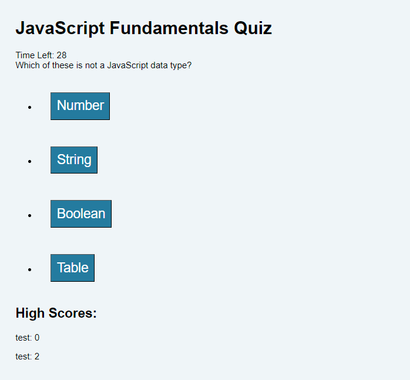

# codingquiz
Help take a timed quiz on JavaScript fundamentals

## Description

Please try to finish the quiz in 30 seconds. For each mistake total time will be reduced by 10 seconds.

### Purpose

The primary features of this wbsite:
1. **Time Coding Quiz**:  Help take timed coding quiz.
2. **Store/Remove Scores**: Keep track of scores to assess progress.
3. **Enable additional questions**: The website is designed to scale and support more questions in the future.

### Changes Made

- Added project portfolio.
- Used semantic html elements.
- Introduced the `<figure>` element for better representation of images.

## Website 

### URL
https://alamm01.github.io/css_demo/

### Screenshot

## Conclusion

This website will be updated as new website projects are completed.
